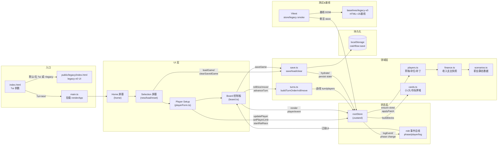

# CashFlow Next 系统图

该图概述了主入口、UI 层、状态层、领域逻辑、持久化与测试基线之间的调用关系，方便在迭代时快速定位依赖与改动范围。

```mermaid
graph LR
  subgraph 入口
    entry["index.html\n?ui 参数"]
    legacyEntry["public/legacy/index.html\nlegacy-v0 UI"]
    main["main.ts\n挂载 renderApp"]
  end

  subgraph "UI 层"
    home["Home 屏幕\n(home)"]
    selection["Selection 屏幕\n(new/load/reset)"]
    setup["Player Setup\n(playerForm.ts)"]
    board["Board 控制板\n(board.ts)"]
  end

  subgraph "状态层"
    store["rootStore\n(zustand)"]
    events["mitt 事件总线\nphase/player/log"]
  end

  subgraph "领域层"
    players["players.ts\n草稿/补位/补丁"]
    finance["finance.ts\n收入支出快照"]
    scenarios["scenarios.ts\n职业静态数据"]
    cards["cards.ts\n小/大/市场牌堆"]
    turns["turns.ts\nbuildTurnOrder/roll/move"]
    save["save.ts\nsave/load/clear"]
  end

  subgraph "持久化"
    storage[("localStorage\ncashflow:save")]
  end

  subgraph "测试&基线"
    vitest["Vitest\nstore/legacy smoke"]
    legacy["baselines/legacy-v0\nHTML+JS基线"]
  end

  entry -->|默认/无 ?ui 或 =legacy| legacyEntry
  entry -->|?ui=next| main
  main --> home
  home --> selection --> setup --> board
  setup -->|"updatePlayer\nsetPlayerLimit\nstartRatRace"| store
  selection -->|"loadGame/\nclearSavedGame"| save
  board -->|"rollDice/move/\nadvanceTurn"| turns
  board -->|"render\nplayer/event"| store
  board -->|"saveGame"| save
  store -->|"logEvent/\nphase change"| events
  events -->|"订阅UI"| board
  store -->|"ensure slots/\napplyPatch"| players
  players --> finance --> scenarios
  store -->|"buildDecks"| cards
  turns -->|"读/改 turn/players"| store
  save -->|"hydrate/\npersist state"| store
  save --> storage
  vitest -->|"断言 store"| store
  vitest -->|"基线 DOM"| legacy
```

> 更新任意影响架构或数据流的改动时，请同步维护以上系统图，以确保文档反映最新行为。
